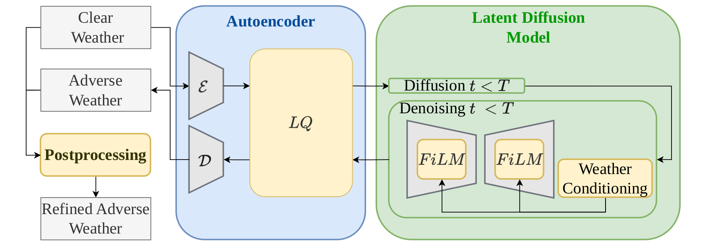

### Augmentation of LiDAR Scenes with Adverse Weather Conditions Using Latent Diffusion Models





## Requirements

We provide an available conda environment named `ldm`:

```
sh init/create_env.sh
conda activate ldm
```

## The Boreas dataset

You can find instructions to download the dataset in [site](https://github.com/utiasASRL/pyboreas)

In Our Method, we use the sequences:
- `boreas-2021-05-06-13-19`
- `boreas-2021-04-08-12-44`
- `boreas-2020-12-01-13-26`
- `boreas-2021-01-26-11-22`


## Training

- Set `data_root` in `configs/autoencoder/boreas/autoencoder.yaml` and `configs/ldm/boreas/ldm.yaml`

- To train LDM, add `path/to/your/autoencoder/ckpt` to `ckpt_path` in `configs/ldm/boreas/ldm.yaml`

```
# train an autoencoder
python main.py -b configs/autoencoder/boreas/autoencoder.yaml -t --gpus 0,

# train LDM
python main.py -b configs/ldm/boreas/ldm.yaml -t --gpus 0,
```

- To resume your training from an existing log directory or an existing checkpoint file, use the flag `-r`:
```
# using a log directory
python main.py -b path/to/your/config.yaml -t --gpus 0, -r path/to/your/log/

# or, using a checkpoint 
python main.py -b path/to/your/config.yaml -t --gpus 0, -r path/to/your/ckpt
```


## Pre-trained weights

Pre-trained weights are avilable in [site](https://drive.google.com/file/d/1E7v1orTunXb7JzoRMtR22YY-dsjxulPs/view?usp=sharing)

## Generate Augmentation
- To generate augmentation with adverse weather conditions (including postprocessing):
```
python scripts/generate_snow_data -r path/to/your/ldm/ckpt
```
- To open the generated .bin file:
```
import numpy as np

path = path/to/your/generated/file

pcd = np.fromfile(os.path.join(path), dtype=np.float64).reshape((-1, 3))
```


## Evaluating Autoencoder


* Statistical metric:
  * Jensen-Shannon Divergence (**JSD**)
* Distance metric:
  * Chamfer Distance (**CD**)

```
pip install open3d

```

```
python scripts/autoencoder_metrics.py -r path/to/your/autoencoder/ckpt
```

## Evaluating Our Method

You can evaluate Our Method in 3D Object Detection using our benchmark in [site](https://github.com/matteandre/B-3DOD-B-AWC)


## Acknowledgement

Our codebase builds on [site](https://github.com/hancyran/LiDAR-Diffusion)


## Citation

```bibtex
@inproceedings{matteazzi2025augmentation,
  title={Augmentation of LiDAR Scenes with Adverse Weather Conditions Using Latent Diffusion Models},
  author={Matteazzi, Andrea and Arnold, Michael and Tutsch, Dietmar},
  booktitle={International Conference on Neural Information Processing},
  pages={198--212},
  year={2025},
  organization={Springer}
}
```
